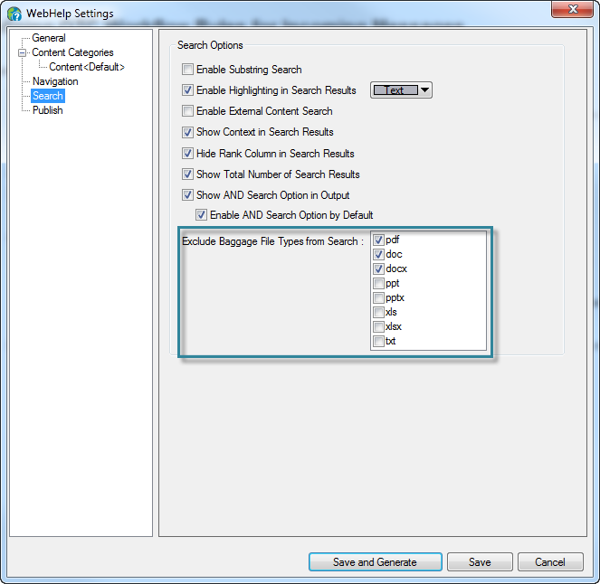
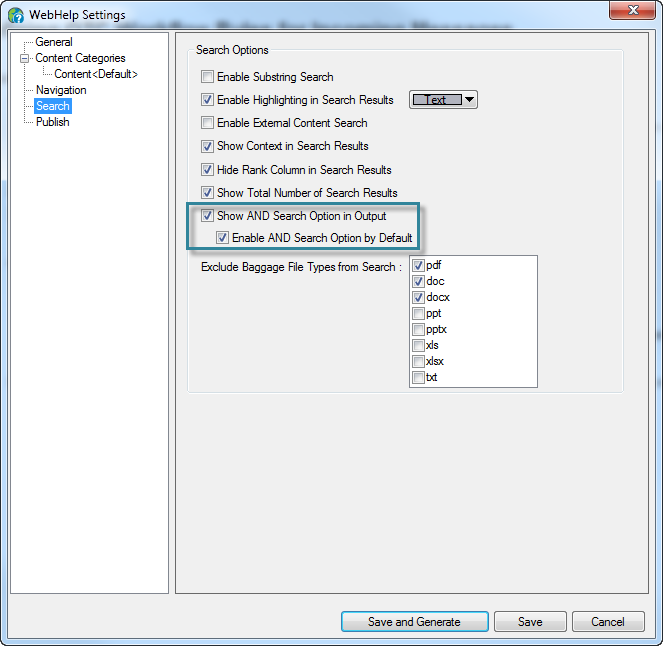
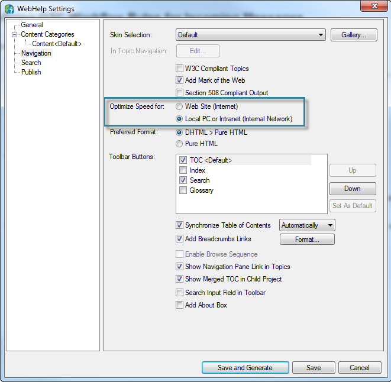
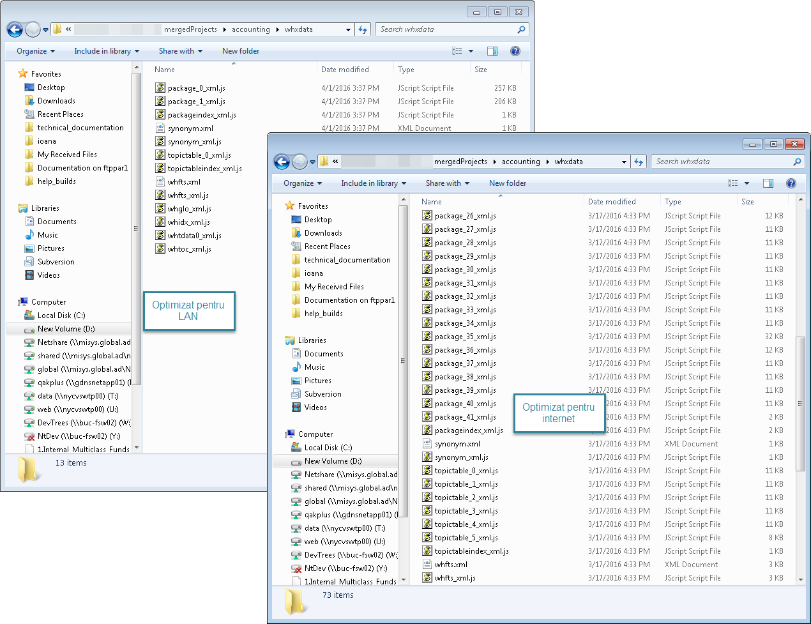
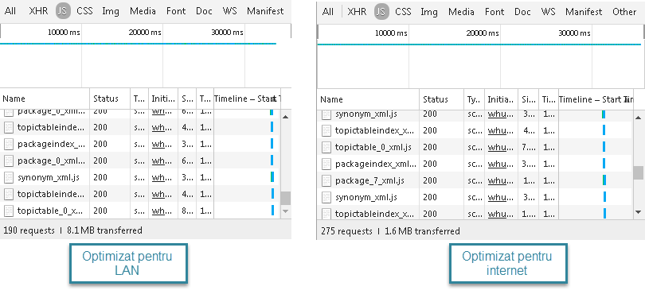

_Published: 2016-03-27_

## The background
We have a rather large online help system - about 6000 topics in 40 separate modules - generated using RoboHelp, in WebHelp format, and delivered both on a website and as an MSI.

## The problem
The search takes too much - 25-30 seconds when run on the server. If the help is installed locally, the search is much faster, but most of the clients use the website.

## The reasons
After a few rounds of testing and a lot of googling, I reached the conclusion that the biggest culprit is the RoboHelp search (but some structural improvements in the content wouldn't hurt either).

## The solutions
Because content changes are more difficult to implement in the short term, I started testing various options fpr optimizing the search.

### Attempt no. 1: No PDF and Word searches
Because each module has a PDF version that contains the same stuff as the online help, I first excluded all such documents from the search.

**Result**: no performance improvement. (But I still think it was a good idea, because we are avoiding duplicate content in the searches.)

### Attempt no. 2: Search on all terms by default
Because RoboHelp 2015 has a new option for this, I enabled "AND" search by default in all modules.

**Result**: no performance improvement (but I wasn't expecting one anyway). I don't know why we had to wait so many years for such an obvious setting, but better late than never, I guess. Now the search should be working like everybody probably imagined it was working already.

### Attempt no. 3: Optimize for LAN
Yeah, it's not really intuitive, after all we are publishing to the internet. Well, apparently the option kept its name from the dial-up days...
Some background first: to enable the search functionality, RoboHelp generates some files (with names like `package__n__xml.js`) in the folder `whxdata`. Every search loads every one of these files... so the more files, the more requests to the server and the slower everything runs. Here is where our option comes in: when the output is optimized for internet, RoboHelp generates more, smaller `package` files (because this was more efficient in the old days, I guess); when the output is optimized for a local network, RoboHelp generates fewer, larger `package` files.

So... I started comparing, after I generated the entire help system with each of the options:

* A search in Windows for the `package*.js` string, in the entire help system: the LAN-optimized version has 6 times fewer `package` files.

* A comparison at the merged project level: the LAN-optimized version has 6 times fewer files in the `whxdata` folder and there are 2 `package` files instead of 41.

* A comparison in Chrome Developer Tools: in the LAN-optimized version there are 190 requests, compared to 275 in the internet-optimized version.

The questions (for which I don't yet have clear answers):

* Why aren't there 6 times fewer requests? After a quick analysis in Developer Tools, I gathered that, for each module, at least 5 requests are sent: `packageindex_xml.js`, `package_0_xml.js`, `synonym_xml.js`, `topictableindex_xml.js` and `topictable_0_xml.js`, so there comes a point when the only way of improving the performance is reducing the total number of modules.

* Why is 5 times more data being downloaded when the content is optimized for LAN, especially considering that fewer requests are sent?

**Result**: an almost insignificant performance improvement, far less than I was hoping for.

## The final conclusion
After a month of testing, I know way more about the RoboHelp search... and I managed to improve the search by whooping 5 seconds (on days with a good connection).

## What next?
Two things:
* Consolidating modules - fewer modules, fewer files, fewer requests, faster search.
* Implementing an external search - Google custom search or Zoom Search.