## Prerequisites

1.  Postman has to be installed.
2.  The required servers must be running.

---

## Importing the Collection

1.  In a web browser, open the URL `http://localhost:7111/swagger/`. If the Manager Server is running on a different port, change the port in the URL. You should see the Swagger UI interface. If you don't, it means something is wrong with the server.
2.  Copy the address of the `swagger.json` file.

    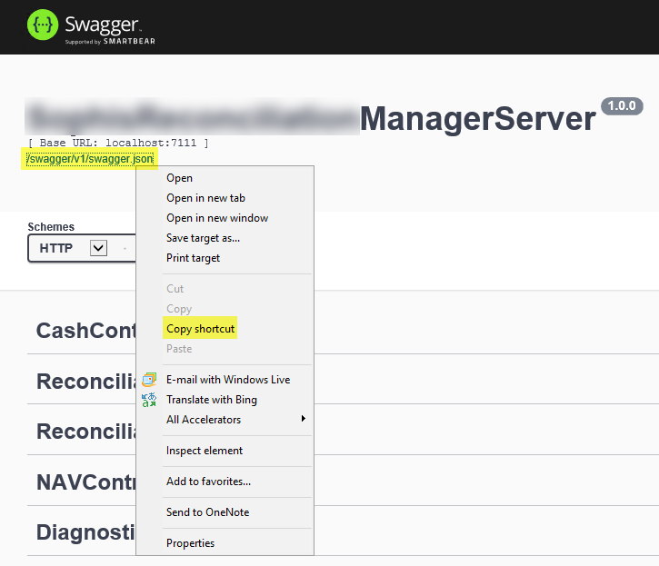

3.  In Postman, click **Import**.
4.  On the **Import from Link** tab, paste the link you copied, then click **Import**.

    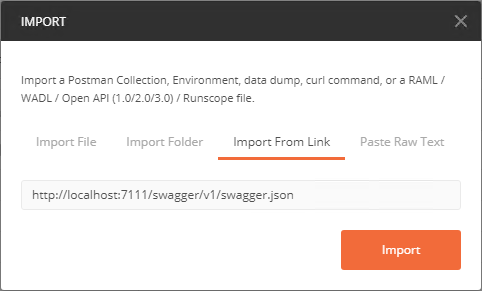

5.  The collection is displayed on the left side of the Postman window.

    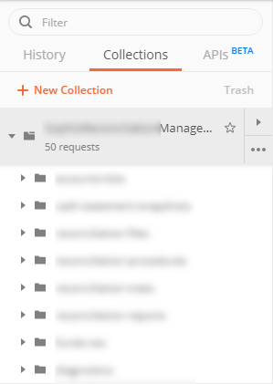

---

## Obtaining an Authentication Token

!!!warning
    Make sure that, in the Postman settings (**File > Settings**), SSL certificate verification is turned off.
	
	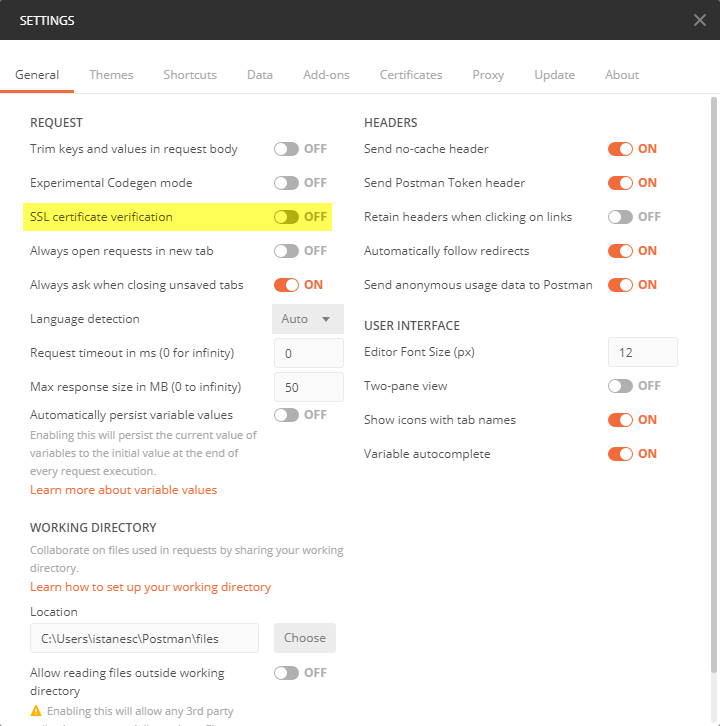

You can change the duration of the token from the Keycloak settings (`https://localhost:8443`).
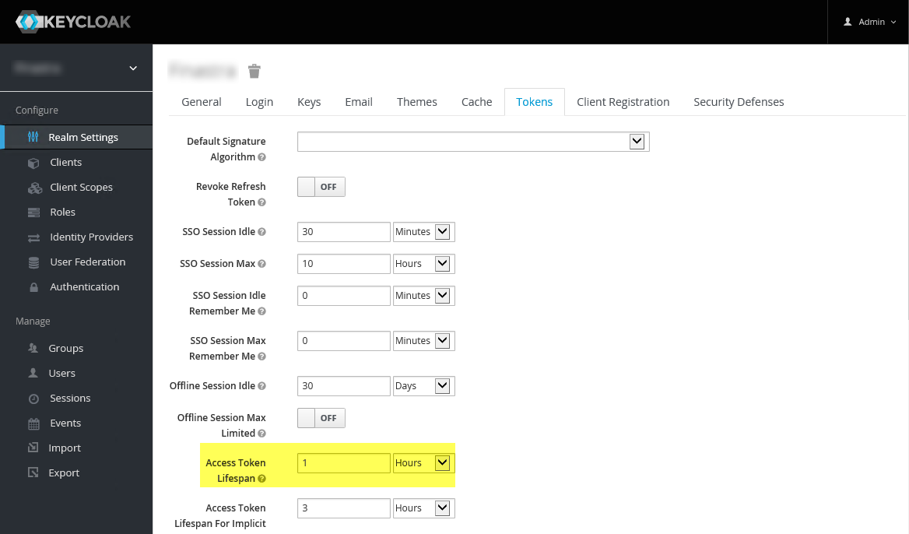

### Authentication at Collection Level

You can set up authentication for the entire collection, so that you don't have to generate a token for each request.

1.  Click **...** next to the collection name and click **Edit**.

    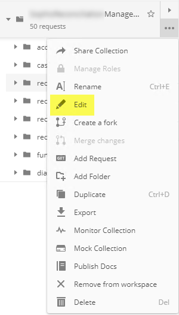

2.  On the **Authorization** tab, set **Type** to **OAuth 2.0** and **Add auth data to** to **Request Headers**.

    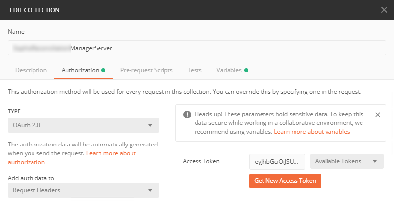

3.  Click **Get New Access Token**.
4.  Set the parameters as in the following screenshot. The **Access Token URL** has to be the address of the Keycloak server. 

    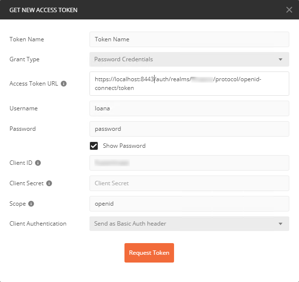

5.  Click **Request Token**. The token is generated.
6.  Scroll down and click **Use Token**.
    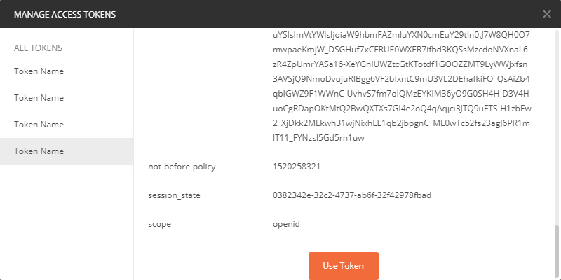
7.  You return to the **Edit Collection** window.
8.  Click **Update** to save the changes to the collection. Any request in this collection will now use this authentication token.

### Authentication at Request Level

1.  In the main Postman area, click **+**. A new tab opens.
2.  Set the method to **POST** and enter the URL `https://localhost:8443/auth/realms/CompanyName/protocol/openid-connect/token` (the address of the Keycloak server).
3.  On the **Body** tab of the request, add the keys in the following screenshot and fill them in with your user name and password. 
   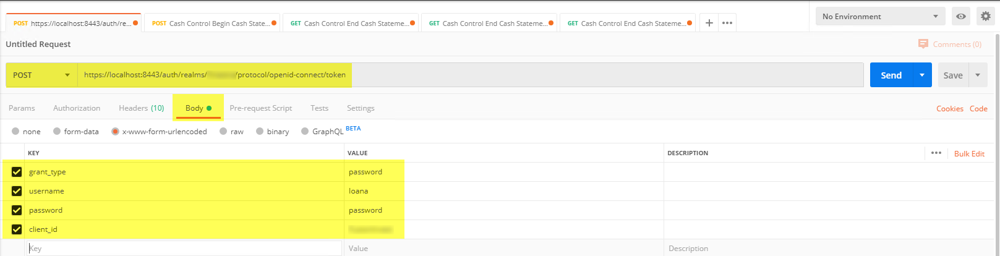
4.  Click **Send**. The bottom part is populated with the token data.
    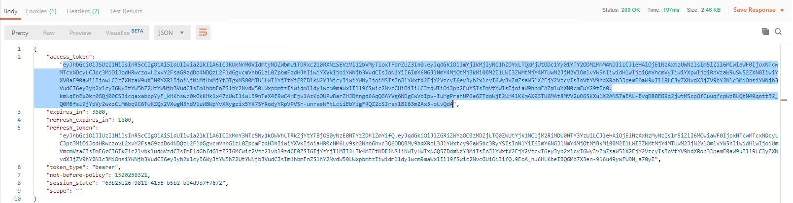
5.  Copy the contents of the **access_token** node.
6.  To use the token, open any request that requires authorization.
7.  On the **Authorization** tab, set **Type** to **Bearer Token** and click the **Token** field. The field is expanded. Paste the token value you copied earlier.
    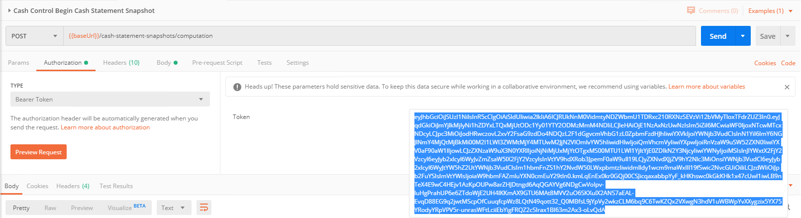
    You can now make the request.

---

## Running a Snapshot

1.  Expand the collection and then expand **snapshots > computation**.
    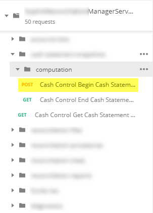
2.  Next to **POST - Cash Control Begin Cash Statement Snapshot**, click **...** and select **Open in New Tab**. A new tab is displayed.
3.  On the **Authorization** tab, set **Type** to **Oauth 2.0**.
4.  On the **Body** tab, fill in the details of the request:
    * `StartDate` is the end date of the snapshot.
    * `ProcedureId` is the ID your procedure has in the database.
    * `Mode` should be `Full`.
    * `AccountLists` should contain the IDs of the accounts.
    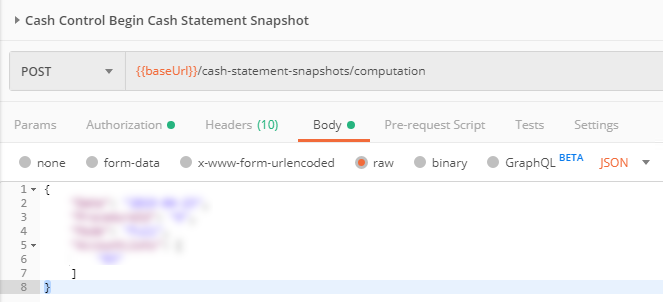
5.  Click **Send**. The request is sent and its **ID** is displayed in the bottom part.
    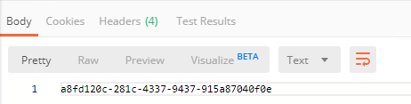
6.  Copy the ID to use it in the next procedure.

---

## Checking the Status of the Snapshot

1.  Expand the collection and then expand **snapshots > computation**.
    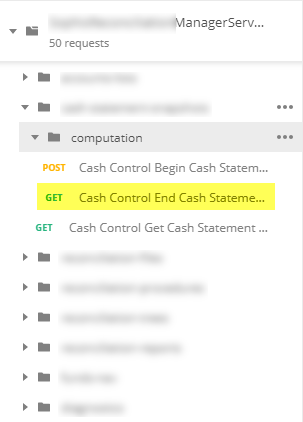
2.  Next to **Get - Cash Control End Cash Statement Snapshot**, click **...** and select **Open in New Tab**. A new tab is displayed.
3.  On the **Params** tab, in the **Path Variables** section, in the `id` parameter, paste the ID you copied in the previous procedure.
    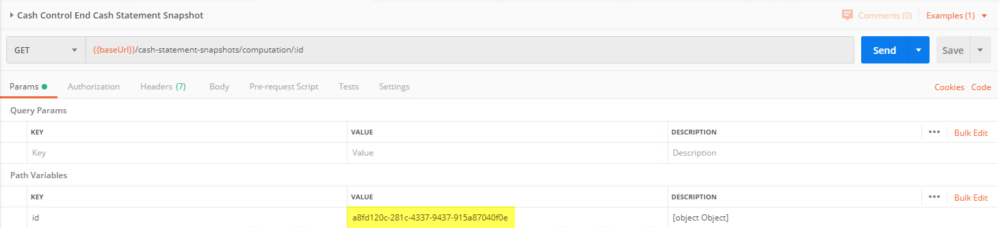
4.  Click **Send**.
    * If the **204 No Content** status is returned, it means that the snapshot is still running.
	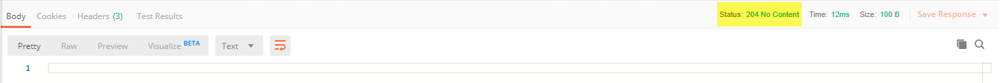
    * If the **200 OK** status is returned and the request body is populated, it means that the snapshot has finished successfully.
	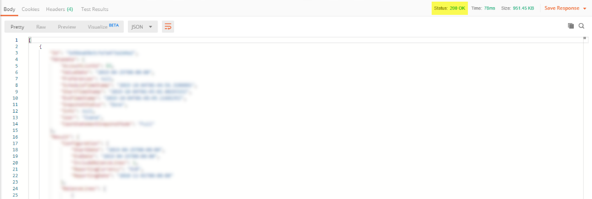