## Pages and Posts

---
### How to add a page or blog post

1. On the Wordpress toolbar, in the **Manage** section, next to **Site Pages** or **Blog Posts**, click **Add**. A blank page or post opens.  
2. Write the title and the content. To learn how to write and organize the content, see *How to work with the post and page editor*.  
3. To see what the published page or post would look like (but without actually making it available for site visitors), click **Preview**.  
4. When you are done, click **Publish**. By default, pages and posts are set up to show up on the site right away. 

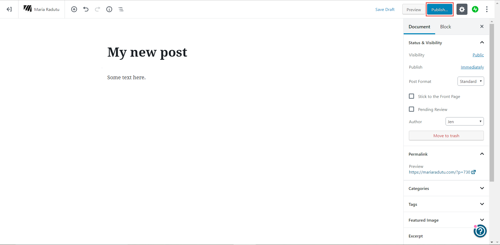

---
### How to add media

1. On the Wordpress toolbar, in the **Manage** section, next to **Media**, click **Add**.  
2. Select a file on your computer and click **Open**. The file is uploaded.

You can add various types of media (images, videos, audio files etc) and you can filter on each type by using the tabs at the top. You can also change the size of the thumbnails by dragging on the circle on the right side.  
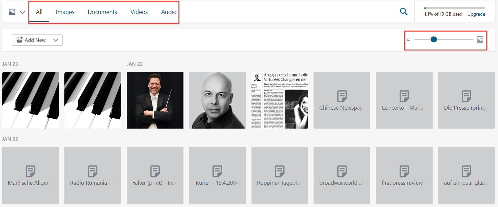

---
### How to modify a page

1. On the Wordpress toolbar, in the **Manage** section, click **Site Pages**.  
2. By default, the published pages are displayed. To see other types of pages (such as drafts), click the corresponding tab on the top part.  
   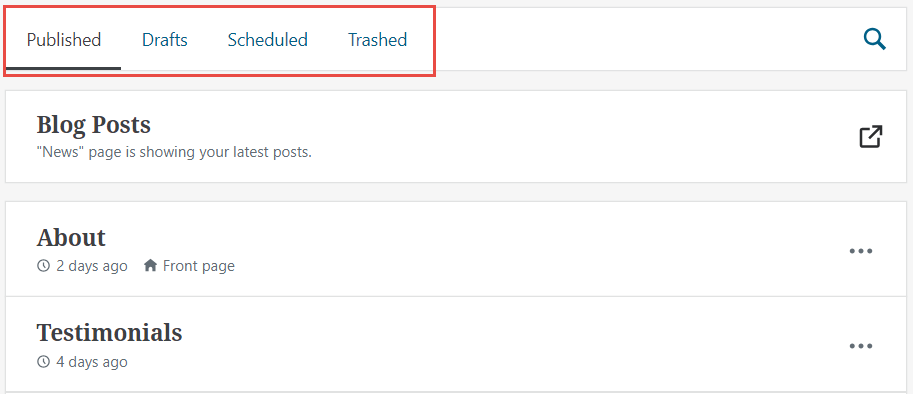 
3. Click the page you want to modify. The page is loaded.  
4. Make the required changes. To learn how to write and organize the content, see *How to work with the post and page editor*.  
5. Click **Update**.

---
### How to modify the content of a blog post

1. On the Wordpress toolbar, in the **Manage** section, click **Blog Posts**.  
2. By default, only the published posts written by you are displayed. To see the other posts, click the corresponding option on the top part. You can filter based on the status of the post and you can also change between viewing only posts written by you and posts written by everyone.  
3. Click the post you want to modify. The post is loaded.  
4. Make the required changes. To learn how to write and organize the content, see *How to work with the post and page editor*.  
5. Click **Update**.

---
### How to hide an already-published page or post

If you want to hide a page or post that is already published, but you don’t want to delete it, you can set it to draft. This way, site visitors won’t be able to see it anymore, but you can publish it again later without having to rewrite it from scratch.

1. Open the post or page you want to hide.  
2. On the top right, click **Switch to draft**.  
   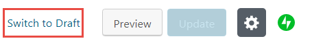

---
### How to delete a page or post  

1. On the Wordpress toolbar, in the **Manage** section, click either **Site Pages** or **Blog Posts**.  
2. On the row of the page or post you want to delete, click the icon with three dots and select **Trash**. The page or post is moved to the **Trashed** category. It is not deleted, but it no longer shows up as published or draft.
   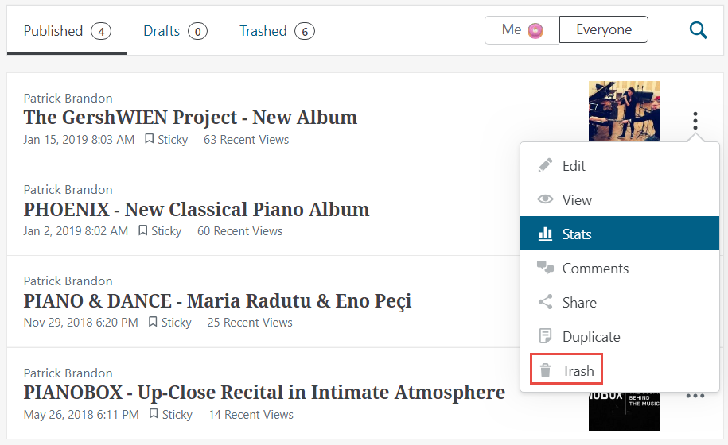  
3. If you want to delete something permanently, go to the **Trashed** tab, select the item and click **Delete**.  
   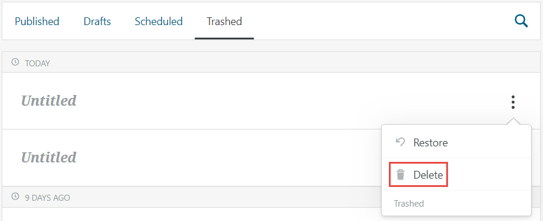

---
### How to schedule a page or blog post to be posted at a certain date 

You can set up a page or post to be published automatically at some predefined point in the future.

1. Create a new page or post as described in *How to add a page or blog post*.  
2. On the right side, make sure you are on the **Document** tab.  
3. Next to **Publish**, click **Immediately**.  
   **Note**: If the post was already scheduled to be published at a certain date, you see the date instead of **Immediately**.  
4. Select the date and time when you want your post to be published.  
5. Click **Publish**. The page or post will automatically appear on the website when you reach the defined date and time.

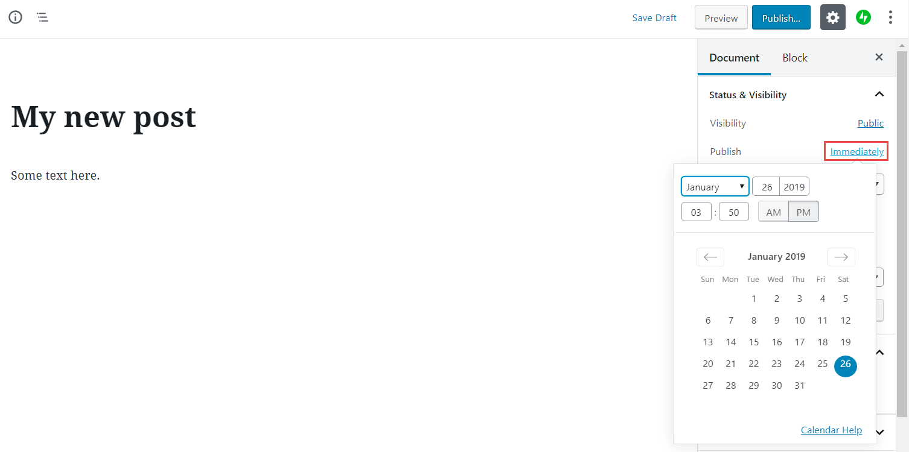

---
### How to change the order of blog posts

The blog posts are always displayed in chronological order (the most recent one is shown first). If you want to change the order, you need to change the dates.  
For example, if you have Post 1 that was published on January 15 and Post 2 that was published on January 13, then Post 1 is displayed on top. To reverse the order, you need to change the date of at least one of the posts, such as making Post 1 published on January 12 (before Post 2).

1. Open the post you want to change the date for.  
2. Next to **Publish**, click the existing date (January 15).  
3. In the calendar, choose a different date (January 12).  
4. Click **Update**. The date and therefore the order of the posts is now changed.

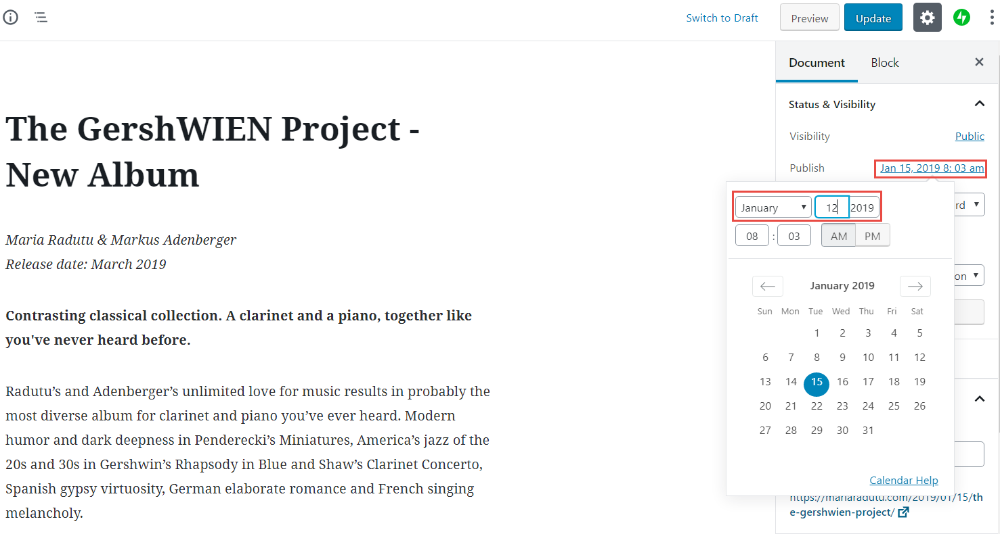

---
### How to work with the post and page editor

The text editor in Wordpress is based on blocks. A block is just a snippet of content and makes it easier to arrange the bits and pieces of your pages and posts. You can arrange the blocks by hovering the mouse over them and dragging the symbol that appears on the left.

This image shows two paragraph blocks. The mouse is hovering over the second one, so it’s highlighted in blue. The symbol highlighted in yellow allows you to reposition the block. When you click inside a block, the formatting toolbar is shown (in the red frame). This toolbar displays different options depending on the type of block.

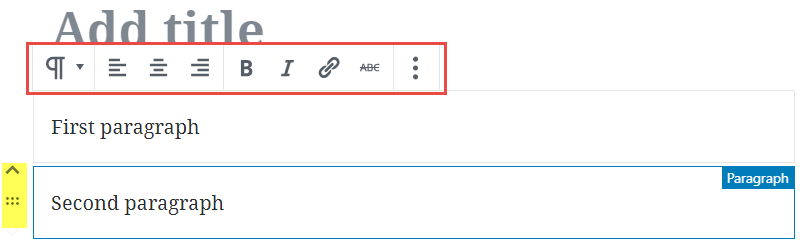

You can add all types of content to a page or post.

**To add plain text:**

1. Write the text. Every time you press enter, a new block is created automatically, but it’s nothing you need to think about. The output will still look like regular text.  
2. Change the look and feel by using the buttons on the formatting toolbar.

You can add more complex types of content in two ways: 

* by directly adding the required type of content   
* by transforming from one type to another

**To add a block directly:**

1. Click inside an empty block or hover the mouse over the top of an empty/populated block. Two types of symbols are displayed:  
   * A **\+** sign (highlighted in yellow in the image) \- you can click it and select the type of the block from a list.  
   * Three symbols (highlighted in orange in the image) \- they are not always the same; if one matches what you need, you can click it to directly add that block.

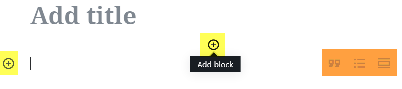

2. After you have added the new block, the toolbar is specific to that type block and enables you to change the formatting and so on.

**To add a block by transforming (list example):**

1. Write each list item on a new line.  
   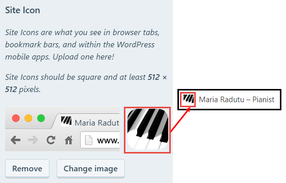  
2. Select all the lines. (Click inside the first one, hold the mouse and drag down to the last one.)  
   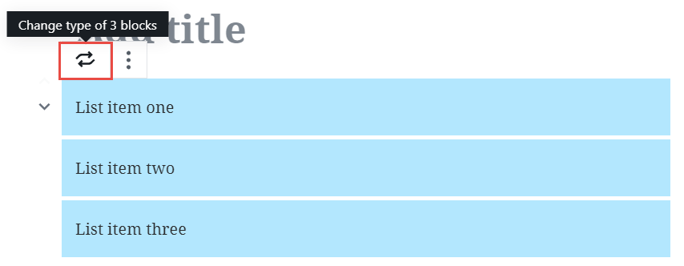  
3. In the toolbar that appears at the top, click the first button. (It is a paragraph symbol that changes to two arrows when you hold your mouse over it.)  
4. Select **List**. The selected blocks are transformed into a list.  
   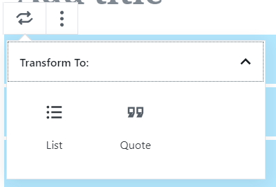

**To delete a block:**

1. Click inside the block you want to delete.  
2. On the formatting toolbar, click the last button (the one with 3 dots) and click **Remove Block**.  
   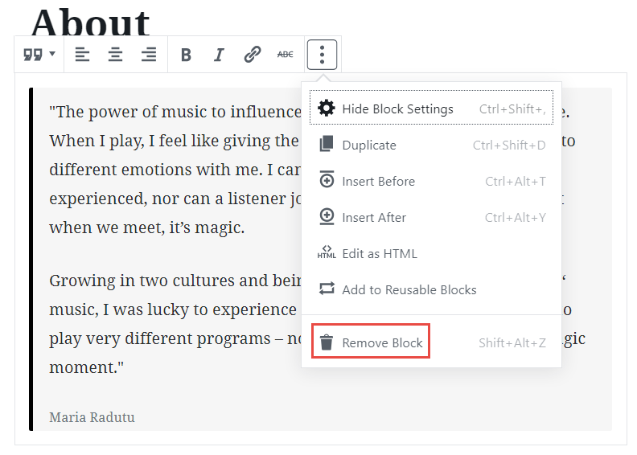

## Customizing the theme

This part is specific to each theme. The steps below are applicable to the [**Ovation**](https://audiotheme.com/view/ovation/) theme.  
All the steps are performed in the Customizer. To open it, click **Customize** on the Wordpress toolbar.

---
### How to change the favicon

1. In the Customizer, click **Site Identity**.  
2. Under **Site Icon**, click **Change Image**.  
3. Select an existing image or upload a new one. The image should be square, but if it is not, Wordpress will allow you to crop it so that it fits correctly.  
4. Click **Publish**.

---
### How to change the site name and description

1. In the Customizer, click **Site Identity**.  
2. Enter the text you want for **Site Title** and **Tagline**.  
3. Click **Publish**.

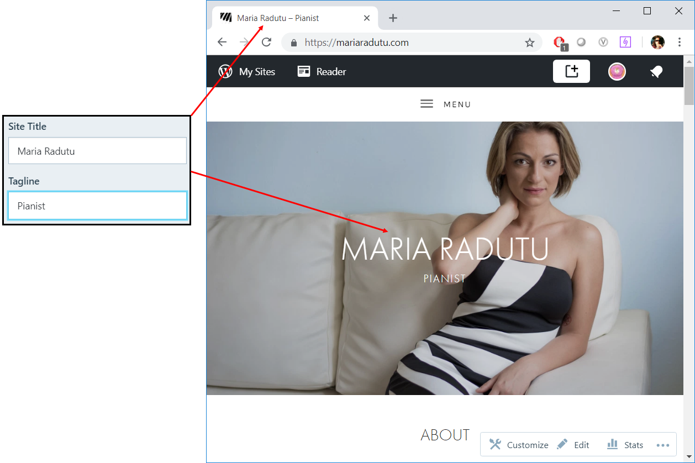

---
### How to change the header image

1. In the Customizer, click **Header Media**.  
2. Click **Add new image** to upload a new header or select from the previously uploaded ones.

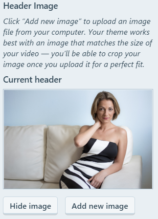

---
### How to change the main menu structure

1. In the Customizer, click **Menus**.  
2. Click the menu that displays **Currently set to: Header Menu**. The structure displayed here indicates how the site menus look like.  
   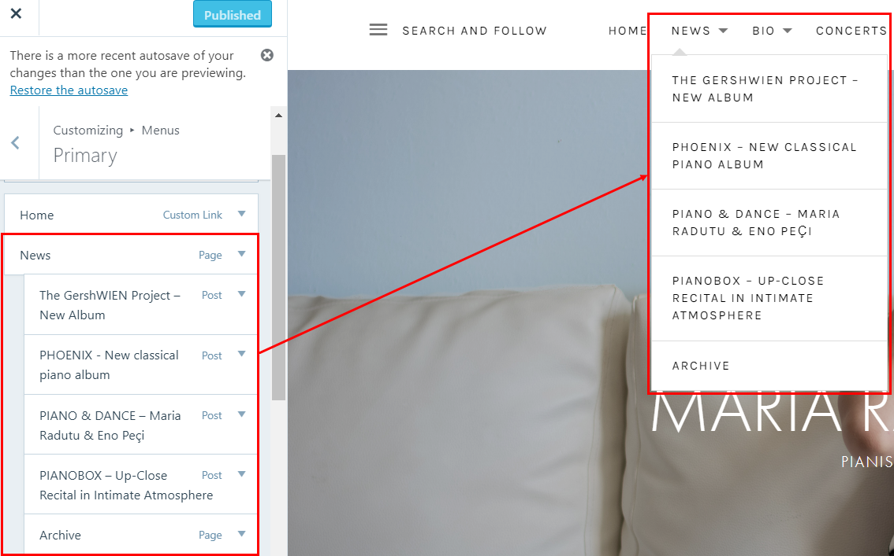  
3. To add a new item to the menu, click **Add items**, then select an item (page, post, etc) from the list that opens.   
4. To remove an item from the menu, click the red X next to it.  
5. When you are done, click **Add items** again.  
6. To change the order of the items in the menus, drag and drop them in the required place. You can create menus with multiple levels by adding items as children of other items.  
   **Note**: You can also reorganize the menus by clicking **Reorder** and using the displayed arrows.  
7. If you don’t want the name in the menu to be the same as the name of the page or post, click the arrow next to the menu item and change the **Navigation Label**.  
   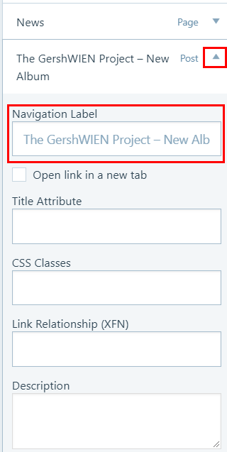

---
### How to change the content on the main page

1. In the **Customizer**, click **Theme Options**, then click **Front Page**.  
2. For each section, select an existing page you want to display.

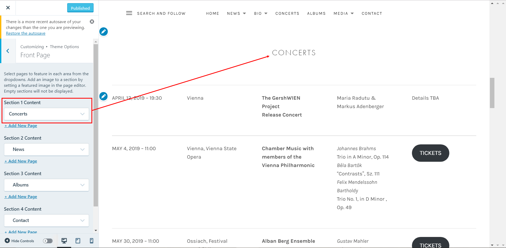

## BONUS: How the site is set up now

---
### Home Page

**About** section:

* Page location: Site Pages \> **About**  
* The page contains one block with type Quote.  
* Added to homepage through Customizer \> **Homepage Settings \> Homepage**

**Concerts** section:

* Page location: Site Pages \> **Concerts** (not CONCERTS)  
* The page contains several reusable blocks and a link. Basically, there are two pages with concert info:  
  * One with the full concert schedule (CONCERTS), that is displayed in the top menu.  
  * One with the first three upcoming concerts (Concerts), that is displayed on the home page and links to the page with the full schedule.

  Because the blocks are reusable, it means that if you edit their content in one of the pages, they are updated automatically in the other page as well.

  ***If you add or remove a concert, you need to edit both pages.*** If you just change the details of an existing concert, you only need to make the changes in one place.

* The page has a featured image, that is displayed as you scroll through the front page.  
* Added to homepage through Customizer \> **Theme Options \> Front Page \> Section 1 Content**

**News** section:

* Page location: Site Pages \> **News**  
* The page doesn’t contain anything. It doesn’t matter, because it’s just a placeholder for the blog posts. Due to this setup, all blog posts will appear on the front page.  
* As far as I can tell, you can’t configure the number of posts to appear on the first page \- there will always be 3\.  
* The page has a featured image, that is displayed as you scroll through the front page.  
* Added to homepage through:  
  * First, in Customizer \> **Homepage Settings \> Post Page** is set to News  
  * Second, in Customizer \> **Theme Options \> Front Page \> Section 2 Content**

**Albums** section:

* Page location: Site Pages \> **Albums**  
* The page doesn’t contain anything. It doesn’t matter, because it’s just meant to be a parent to the actual album pages.  
* Under **Page Attributes**, the **Template** is **Record Archive**.  
* As far as I can tell, you can’t configure the number of albums to appear on the first page \- there will always be 3\.  
* The page has a featured image, that is displayed as you scroll through the front page.  
* Added to homepage through Customizer \> **Theme Options \> Front Page \> Section 3 Content**

Each album page is configured as follows:

* **Page title** \- the name of the album. This is displayed on the front page, under the album cover, and on the album page, above the album details.  
* **Page contents** \- the description of the album and the Spotify playlist. The layout is done with columns. The Spotify playlist is created automatically when you paste the Spotify album link. This is displayed only on the album page, below the cover and description.  
* **Page featured image** \- the album cover. This is displayed on the front page and the album page.  
* **Page excerpt** \- the album details and links. This is written directly in HTML and is displayed only on the album page, next to the cover.  
* **Page parent** \- has to be **Albums**  
* **Page attributes \- template** \- has to be **Record Archive**

**Contact** section:

* Page location: Site Pages \> **Contact**  
* The page contains the contact information and a contact form.  
* Added to homepage through Customizer \> **Theme Options \> Front Page \> Section 4 Content**

---
### News Page

When you click **News** in the menu at the top, you are taken to the blog posts archive. To see them all, go to Wordpress toolbar \> **Blog Posts**.  
However, the items in the menu were added *manually* \- therefore, if you create a new blog post, it will show up on the front page, but not in the menu. If you want it in the menu as well, you need to add from the Customizer (see *How to change the main menu structure*).  
![][assets/portfolio-images/wordpress/image21]  
The **Archive** link at the end is a page (Site Pages \> **Archive**). The page is empty, but configured up with **Page Attributes \> Template** set to **Grid Page**.  
Each of the archive projects is set up as a separate page configured as follows:

* **Page parent** \- has to be **Archive**   
* **Page featured image** \- displayed on the home page and the page itself

---
### Bio Page

Configured similarly to the **News** page:

* The **Bio** page itself is configured with the template set to **Grid Page**.  
* The **Vita English**, **Vita German** and **Press Reviews** pages each have a featured image and have the parent page set to **Bio**.

---
### Concerts Page

This is a single page, located in Site Pages \> **CONCERTS** (in upper case). It’s the full list of the upcoming concerts, as explained for the **Concerts** section of the home page.

---
### Albums Page

This is a single page, located in Site Pages \> **Albums**. It’s the same page that is displayed on the home page.

---
### Media Page

The **Media** section of the site is made out of two layers of child pages. When you click **Media** in the menu, your are first taken to a page (Site Pages \> **Media**) that links to **Images** and **Videos**. The **Images** page links to three categories of images, while the **Videos** page links to each video page.  
The pages are configured as follows:

* **Media** \- no content, template set to **Grid Page**  
* **Images** \- no content, template set to **Grid Page** and parent set to **Media**  
* **Image**, **In Concert** and **Maria & Friends** \- template set to **Full-Width** Page, a gallery block with the images themselves, and parent set to **Images**  
* **Videos** \- no content, template set to **Video Archive** and parent set to **Media**  
* **Each video page** \- the embedded YouTube video, a featured image chosen (this is displayed on the **Videos** pages), template set to **Video Archive** and parent set to **Videos**

---
### Contact Page

This is a single page, located in Site Pages \> **Contact**. It’s the same page that is displayed on the home page.